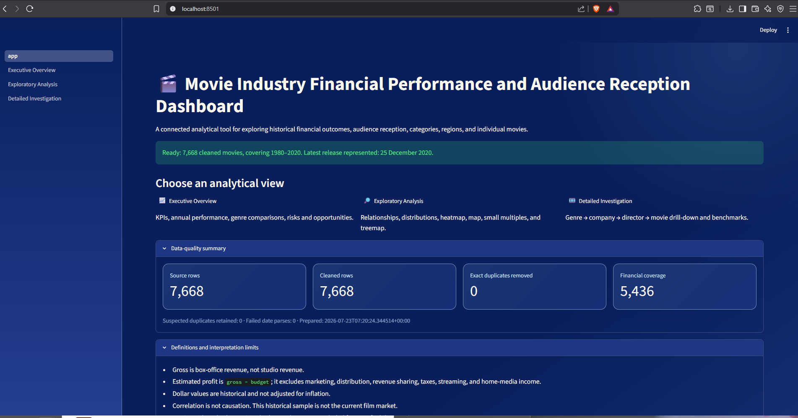
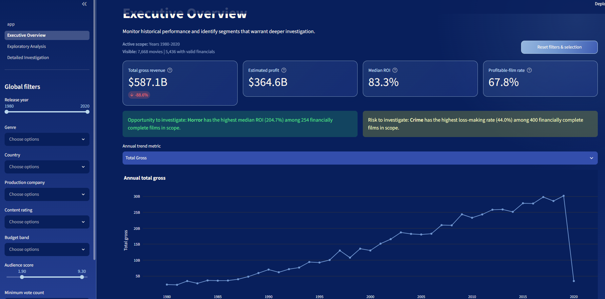
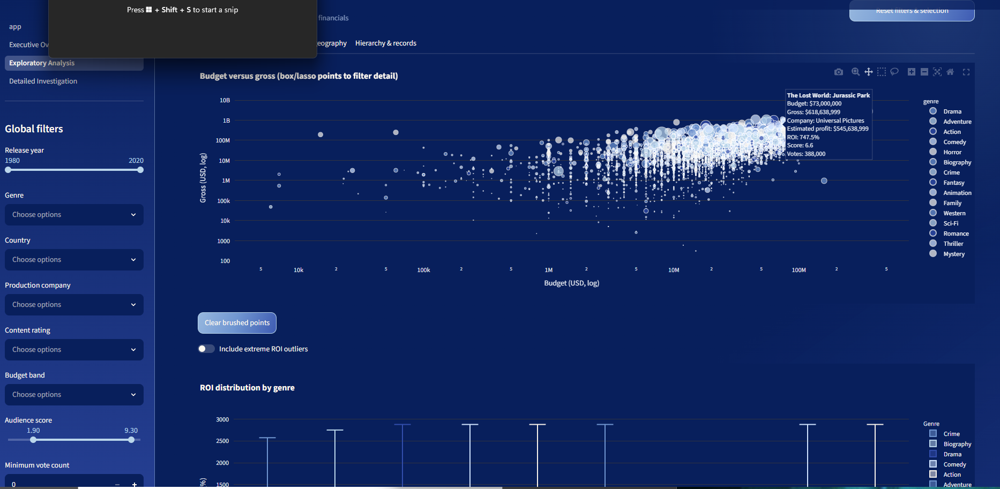
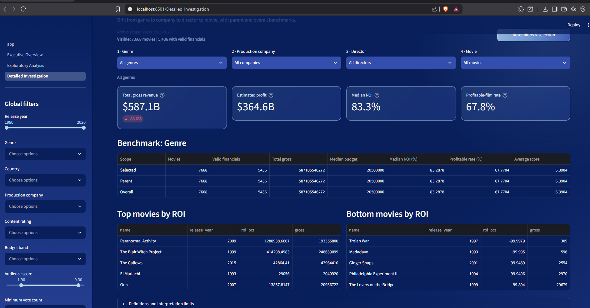

# Movie Industry Financial Performance and Audience Reception Dashboard

An interactive Streamlit business-intelligence dashboard for exploring historical
movie performance by genre, company, director, country, rating, and release period.
It connects executive KPIs to relationship, distribution, geographic, temporal,
hierarchical, and movie-level investigation views.

## Dashboard screenshots

### Application home



### Executive Overview



### Exploratory Analysis



### Detailed Investigation



## Dataset

The project uses Daniel Grijalva's **Movie Industry** dataset from
[Kaggle](https://www.kaggle.com/datasets/danielgrijalvas/movies). The raw CSV is
not committed. Download it and place it at either:

```text
movies.csv
```

or:

```text
data/raw/movies.csv
```

No API keys, web scraping, database, or external services are used.

## Setup and run

Python 3.11 or 3.12 is recommended.

```powershell
python -m venv .venv
.venv\Scripts\Activate.ps1
python -m pip install -r requirements.txt
python scripts/prepare_data.py
pytest
ruff check .
streamlit run app.py
```

The preparation command validates and cleans the CSV, then writes:

- `data/processed/movies_clean.parquet`
- `data/processed/data_quality_summary.json`
- `data/processed/insight_evidence.json`

If the raw or prepared files are missing, the CLI and application display setup
instructions rather than a raw traceback.

## Views and connected interaction

1. **Executive Overview** presents four filter-responsive KPIs, annual trends,
   genre comparison, risks, opportunities, quality coverage, and deterministic
   evidence.
2. **Exploratory Analysis** presents budget-versus-gross brushing, an ROI box
   plot, genre-by-decade heatmap, country choropleth, top-six genre small
   multiples, a genre/company/movie treemap, search, table, and CSV export.
3. **Detailed Investigation** supports the hierarchy **Genre → Production
   company → Director → Movie**, return through each control, parent/overall
   benchmarks, rankings, top/bottom films, and details on demand.

Selecting a genre stores it in Streamlit session state. KPIs and the annual trend
recalculate, the scatter and ROI distribution narrow to matching films, company
rankings show companies within the genre, and the linked detail table updates.
Selecting a country follows the same state route. Stable fallback controls are
provided for critical chart interactions.

## Visual theme

The dashboard uses a space-inspired dark palette consistently across Streamlit
controls and both chart libraries:

- **Venus** `#BAD6EB` — primary highlights, borders, and gradient lead
- **Galaxy** `#081F5C` — deep background
- **Universe** `#7096D1` — secondary accent and gradient midpoint
- **Planetary** `#334EAC` — gradient tail and buttons
- **Milky Way** `#FFF9F0` — foreground text
- **Sky** `#D0E3FF` — supporting highlights
- **Meteor** `#F7F2EB` — light neutral

## Metric definitions

- **Valid budget/gross:** non-null and strictly positive. Zero is treated as
  unavailable.
- **Valid financials:** both budget and gross are valid.
- **Estimated profit:** `gross - budget`, only for valid financial records.
- **ROI:** `(gross - budget) / budget × 100`, only for valid financial records.
- **Gross-to-budget ratio:** `gross / budget`.
- **Profitable film:** estimated profit is greater than zero; null when financial
  data is incomplete.
- **Score bands:** Low (<5), Moderate (5–<6.5), Good (6.5–<7.5), and Excellent
  (≥7.5).
- **Budget bands:** quartiles of positive budget values; the actual boundaries
  are stored in the quality JSON.
- **Performance:** Loss-making (<0% ROI), Low return (0–<100%), Moderate return
  (100–<300%), High return (300–<700%), or Exceptional return (≥700%).
- **High-budget underperformer:** budget at/above the 75th percentile and ROI
  below zero.
- **Breakout success:** budget at/below the 25th percentile and ROI at/above the
  75th percentile.

Median/rate rankings require at least 10 valid financial records. Executive
opportunity/risk messages require at least 20.

## Analytical question-to-visual mapping

| Visual | Questions supported |
|---|---|
| KPI cards and genre bar | Leading gross/profit segments; genre metric differences |
| Company ranking | Company output and median financial performance |
| Annual trend and genre small multiples | Change across years/decades and major genres |
| Budget-versus-gross scatter | Relationships among budget, gross, score, votes, and runtime |
| ROI box plot | Genre return distributions and unusual outcomes |
| Genre-by-decade heatmap | Temporal category differences and loss/profit patterns |
| Country map | Country and rating-group performance comparisons |
| Genre/company/movie treemap | Revenue composition and drillable hierarchy |
| Drill-down benchmark and movie panel | Above/below-parent performance and anomalies |

## Data-quality behaviour

The pipeline normalises headers, validates all 15 required source columns,
coerces numeric fields, parses release dates with year fallback, standardises
empty categories to `Unknown`, removes exact duplicates, flags suspected
duplicates, and retains IQR outliers with explicit flags. Every output record has
a stable, unique movie ID and its original source row number.

## Project structure

```text
app.py                         Home and setup status
pages/                         Three analytical views
scripts/prepare_data.py        Repeatable preparation pipeline
src/                           Cleaning, quality, metrics, filters, state,
                               charts, insights, loading, and reusable UI
tests/                         Cleaning, metric, filter, and quality tests
data/processed/                Generated Parquet and evidence JSON
.streamlit/config.toml         Dashboard configuration
requirements*.txt              Direct and resolved dependencies
```

## Interpretation limitations

Gross is box-office revenue, not money retained by a studio. Estimated profit is
not actual net profit: marketing, distribution, cinema revenue sharing, taxes,
streaming, and home-media income are absent. Historical dollars are not adjusted
for inflation. The dataset is a historical sample, not the current market.
Missing budget/gross records are excluded from profitability calculations, and
correlations do not establish causation.
